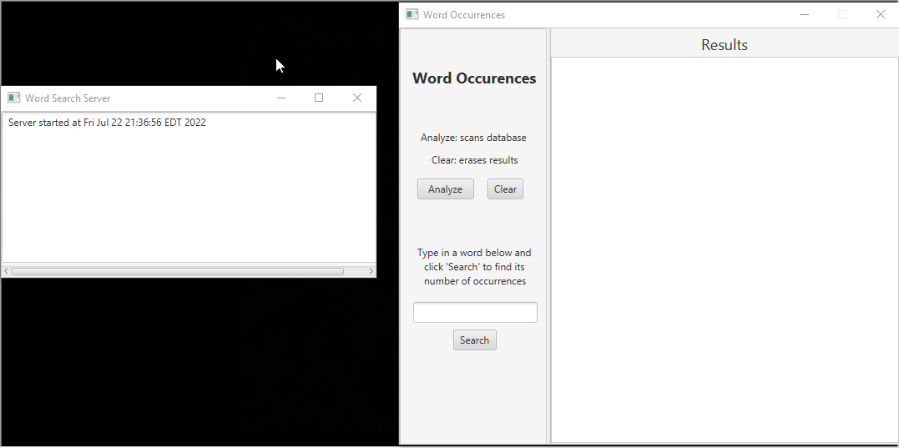
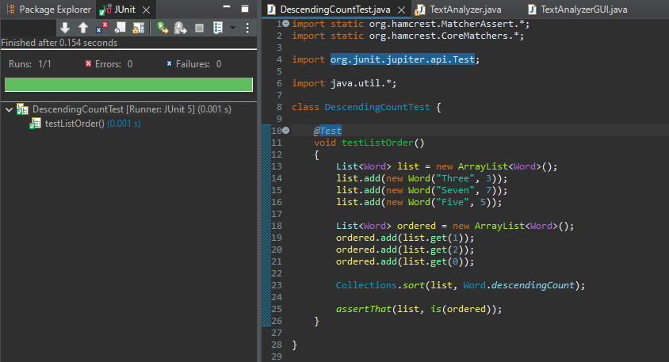
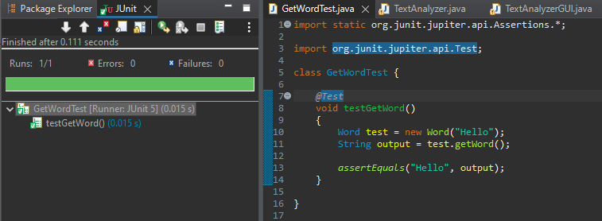

# Word Occurrences Application

### Assignment Description
You have completed the Word Occurrences mini-project over the semester.  Please now submit the combined final project.

This project covered the following topics

+ Source control
+ Documentation/JavaDoc
+ Creating a UI
+ Unit testing
+ Databases
+ Deployment

### Requirements
- JavaFX runtime (https://openjfx.io/) <br>
- [WordOccurrences.jar](WordOccurrences.jar)

### Local Run Instructions (Windows)
1. Open the Windows Command Prompt terminal
2. Navigate to the directory location of `WordOccurrences.jar`
3. Enter the following into terminal:
```
java --module-path "<PATH_TO_FX/lib>" --add-modules=javafx.controls,javafx.fxml -jar WordOccurrences.jar
```

### Preview


### JavaDoc @ https://rlao1.github.io/word-occurrences/


### JUnit Testing
 
